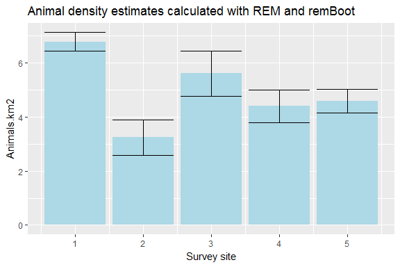

Read the packaged data file. These data are from a study of hares in Northern Ireland, published as Caravaggi _et al._ (2016). The first 5 columns of any data set must follow the same format in terms of column contents.


```r
library(remBoot)

data(hDat)
```

Alternatively, generate relevant simulated data. 


```r
remDat <- data.frame(cbind(site <- sample(1:4, 200, replace=TRUE),
                           cam <- sample(1:20, 200, replace = TRUE),
                           count <- sample(1:3, 200, replace = TRUE),
                           dist <- runif(200, min=0, max=0.006),
                           theta <- runif(200, min=0, max=0.6)))

colnames(remDat) <- c("site","cam", "count", "dist", "theta")
```


Now we'll check the first few rows of data, check the sample size for each site, and check data consistency.


```r
head(hDat) 
```

```
##   site count  dist theta
## 1    1     1 0.003  0.67
## 2    1     1 0.003  0.67
## 3    1     1 0.003  0.67
## 4    1     1 0.004  0.39
## 5    1     1 0.003  0.18
## 6    1     1 0.005  0.10
```

```r
tapply(hDat[,3], hDat[,1], length) 
```

```
##  1  2  3  4  5 
## 36 16 20 19 27
```

```r
sum(tapply(hDat[,3], hDat[,1], length)) == nrow(hDat) 
```

```
## [1] TRUE
```

We'll use two functions to split the data according to survey site (__split_dat__) and store the number of rows. These data will be used for iterative resampling during bootstrapping.


```r
grpDat <- split_dat(hDat)
```

Check that the code has done what we wanted


```r
lapply(grpDat, head)
```

```
## [[1]]
##   site count  dist theta
## 1    1     1 0.003  0.67
## 2    1     1 0.003  0.67
## 3    1     1 0.003  0.67
## 4    1     1 0.004  0.39
## 5    1     1 0.003  0.18
## 6    1     1 0.005  0.10
## 
## [[2]]
##    site count  dist theta
## 37    2     1 0.001  1.37
## 38    2     1 0.006  0.06
## 39    2     1 0.003  0.30
## 40    2     1 0.002  0.18
## 41    2     1 0.003  0.17
## 42    2     1 0.005  0.51
## 
## [[3]]
##    site count  dist theta
## 53    3     1 0.007  0.29
## 54    3     1 0.006  0.24
## 55    3     1 0.006  0.12
## 56    3     1 0.005  0.19
## 57    3     1 0.002  0.31
## 58    3     1 0.004  0.16
## 
## [[4]]
##    site count  dist theta
## 73    4     1 0.003  0.28
## 74    4     1 0.007  0.18
## 75    4     1 0.006  0.35
## 76    4     1 0.002  0.14
## 77    4     1 0.001  0.30
## 78    4     1 0.003  0.50
## 
## [[5]]
##    site count  dist theta
## 92    5     1 0.003  0.03
## 93    5     1 0.002  0.10
## 94    5     1 0.002  0.64
## 95    5     1 0.006  0.19
## 96    5     1 0.005  0.26
## 97    5     1 0.006  0.20
```

```r
lapply(grpDat, nrow)
```

```
## [[1]]
## [1] 36
## 
## [[2]]
## [1] 16
## 
## [[3]]
## [1] 20
## 
## [[4]]
## [1] 19
## 
## [[5]]
## [1] 27
```

The REM requires that the user provide survey effort (i.e. camera hours; tm) and the distance travelled by the focal species in 24 hours (given in km; v). Here, we assign values to tm and v.


```r
tm <- 1880
v <- 0.89
```

We then use the REM function (__rem__) to calculate densities for each site. Change the grpDat value to specify a different site.


```r
rem(dat = grpDat[[1]], tm, v) 
```

```
## [1] 6.777417
```


If tm and v differ for each survey site, we can specify them alongside the REM function, as below. Note that if the focal species is a constant, v should not change.


```r
rem(dat = grpDat[[1]], tm = 3600, v = 1.4) 
```

```
## [1] 2.249995
```

```r
rem(dat = grpDat[[2]], tm = 3360, v = 1.4) 
```

```
## [1] 1.153592
```

If there is only one survey site, we can calulate its density, by specifying the data frame rather than the group. Note that the two examples below differ as one calls the stored tm and v, while the other defines them.


```r
rem(hDat, tm, v) 
```

```
## [1] 23.89725
```

```r
rem(hDat, tm = 3360, v = 1.4) 
```

```
## [1] 8.500186
```

Now we'll calculate variance for each study site. First, define the number of bootstrapping iterations:


```r
nboots <- 1000
```

Now we use the bootstrapping function __boot_sd__ on each group dataframe n (i.e.nboots) times. Note that tm and v must be the same across all sites. If this is not the case, split your data into separate dataframes before bootstrapping and run the function on each group individually.


```r
remsD <- lapply(grpDat, boot_sd)
```

Now calculate the standard deviation for each site.


```r
remsSD <- lapply(remsD, sd)
remsSD
```

```
## [[1]]
## [1] 0.3404196
## 
## [[2]]
## [1] 0.6588289
## 
## [[3]]
## [1] 0.8322089
## 
## [[4]]
## [1] 0.6020076
## 
## [[5]]
## [1] 0.4410272
```


Alternatively, we can forgo all the above and use the __remBoot__ function to split and group data and calculate variance (SD and/or 95% confidence intervals) in one go. __remBoot__ requires that all sites have the same values for tm and v. As before, we'll define _tm_,  _v_ and _nboots_ a priori:


```r
tm <- 1880
v <- 0.89
nboots <- 1000
```


```r
output <- remBoot(hDat, tm, v, nboots, error_stat = c("sd"))
output
```

```
## $sd
## $sd[[1]]
## [1] 0.3301774
## 
## $sd[[2]]
## [1] 0.6662613
## 
## $sd[[3]]
## [1] 0.8090278
## 
## $sd[[4]]
## [1] 0.6083548
## 
## $sd[[5]]
## [1] 0.4582534
```

Alternatively, we could pass the values to the function directly.


```r
output <- remBoot(hDat, tm = 2870, v = 1.8, nboots, error_stat = c("ci"))
output
```

```
## $ci
##          Lower    Upper
## [1,] 1.9893997 2.453250
## [2,] 0.7374566 1.523955
## [3,] 1.4003396 2.495413
## [4,] 1.1404308 1.884505
## [5,] 1.2432151 1.791427
```

We can then collate our data into a single data frame and generate a simple bar plot with error bars to lok at relative differences between sites.


```r
ggplot(estDat, aes(x = site, y = estDat$den)) +  
  geom_bar(position = position_dodge(), stat="identity", fill="light blue") + 
  geom_errorbar(aes(ymin=den-sd, ymax=den+sd)) +
  scale_x_continuous(name="Survey site") +
  scale_y_continuous(name="Animals.km2") +
  ggtitle("Animal density estimates calculated with REM and remBoot")
```

<!-- -->

##References

Caravaggi, A et al. (2016) [Remote Sensing in Ecology and Conservation](http://onlinelibrary.wiley.com/doi/10.1002/rse2.11/abstract) 2:45-58.

Rowcliffe, JM et al. (2008) [Journal of Applied Ecology](http://onlinelibrary.wiley.com/doi/10.1111/j.1365-2664.2008.01473.x/full) 45:1228-1236.
